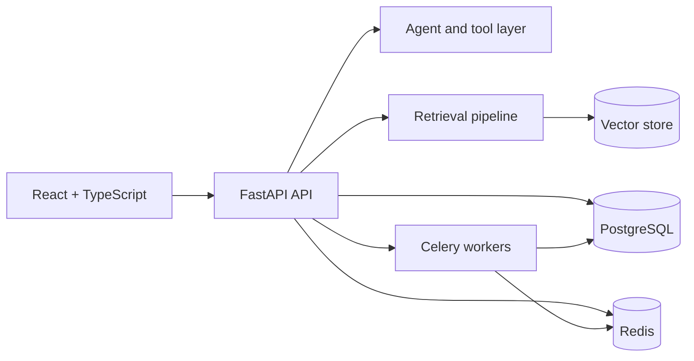

# ContextOS

ContextOS is an AI operating layer for querying internal knowledge and executing traceable actions. The repository combines a typed React interface with a FastAPI backend, retrieval pipeline, asynchronous workers, persistent storage, caching, and operational instrumentation.

## Architecture



The backend uses explicit API, service, model, schema, and infrastructure layers. PostgreSQL stores durable application state, Redis supports caching and task coordination, and Celery handles background work. Health, readiness, metrics, and structured logging surfaces are documented for local and containerized operation.

## Capabilities

- conversational interface with source attribution
- RAG ingestion and semantic retrieval
- agent execution with action tracking
- asynchronous PostgreSQL access and Alembic migrations
- Redis caching and Celery background tasks
- Prometheus-compatible metrics, health checks, and request tracing
- Docker Compose development environment

## Quick Start

### Backend

```bash
cd backend
docker compose up -d
```

The API is available at `http://localhost:8000`, with OpenAPI documentation at `http://localhost:8000/docs`.

### Frontend

```bash
npm install
npm run dev
```

The frontend defaults to `http://localhost:8000`; set `VITE_API_URL` to override the API location. The application is available at `http://localhost:5173`.

## Project Structure

```text
ContextOS/
├── components/          # React product interface
├── services/            # Typed frontend API client
├── backend/
│   ├── app/
│   │   ├── api/         # HTTP routes
│   │   ├── core/        # Configuration and infrastructure
│   │   ├── db/          # Database sessions and models
│   │   └── services/    # Retrieval, agents, caching, and workers
│   ├── alembic/         # Database migrations
│   └── tests/           # Backend tests
└── package.json
```

## Validation

```bash
# Backend
cd backend
pytest

# Frontend
cd ..
npm run build
```

## Documentation

- [Backend overview](backend/README.md)
- [Architecture](backend/ARCHITECTURE.md)
- [RAG pipeline](backend/RAG_PIPELINE.md)
- [AI agent](backend/AI_AGENT.md)
- [Observability](backend/OBSERVABILITY.md)
- [Frontend setup](FRONTEND_SETUP.md)
